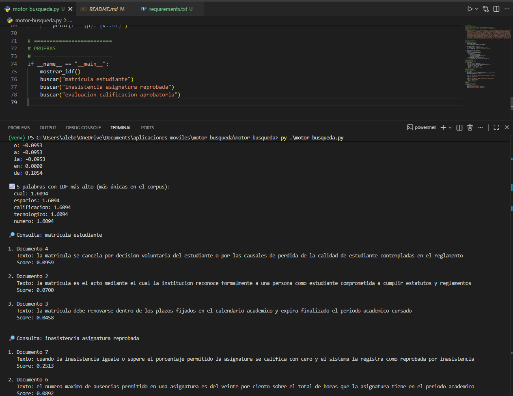

# motor-busqueda-tfidf
Taller: Motor de búsqueda sobre reglamento académico usando TF-IDF

## Introducción

Este repositorio contiene la implementación de un motor de búsqueda basado en el algoritmo **TF-IDF** (Term Frequency – Inverse Document Frequency), aplicado a un corpus de 10 artículos simulados del reglamento académico universitario. El objetivo es que un estudiante pueda consultar en lenguaje natural y recibir los fragmentos más relevantes del reglamento ordenados por relevancia.

## ¿Cómo funciona TF-IDF?

TF-IDF pondera la importancia de cada palabra en un documento relativo al corpus completo:

- **TF (Term Frequency):** `frecuencia_palabra / total_palabras_doc`  
- **IDF (Inverse Document Frequency):** `log(Total_Docs / Docs_con_la_palabra)`  
- **Score final:** suma del `TF × IDF` de cada palabra de la consulta sobre el documento.

Palabras muy frecuentes en todos los documentos (como "la", "de") reciben un IDF bajo y contribuyen poco al score. Palabras únicas y específicas (como "obligatoria", "calidad") reciben IDF alto y elevan el score del documento relevante.

## Estructura del Proyecto

```
motor-busqueda/
├── motor-busqueda.py    # Script principal con TF-IDF y casos de prueba
├── requirements.txt     # Dependencias del proyecto
└── README.md
```

## Requisitos de Instalación

**1. Python 3:** Verifique su versión con:

```bash
# Windows
python --version

# macOS / Linux
python3 --version
```

Puede descargarlo desde [python.org](https://www.python.org/).

**2. Dependencias:** El script usa `numpy`. Instálelas con:

```bash
pip install -r requirements.txt
```

El archivo `requirements.txt` contiene:
```
numpy
```

## Ejecución del Script

### 1. Clonar el repositorio

```bash
git clone https://github.com/AlejandraBenavidez05/motor-busqueda.git
cd motor-busqueda
```

### 2. Crear entorno virtual (recomendado)

```bash
# Crear
python3 -m venv venv

# Activar en macOS / Linux
source venv/bin/activate

# Activar en Windows (cmd)
venv\Scripts\activate

# Activar en Windows (PowerShell)
.\venv\Scripts\activate
```

### 3. Instalar dependencias

```bash
pip install -r requirements.txt
```

### 4. Ejecutar

```bash
python3 motor-busqueda.py
# o en Windows:
python motor-busqueda.py
```

## Ejemplo de Salida

```
📉 5 palabras con IDF más bajo:
a: -0.0953
la: 0.0000
de: 0.1054
al: 0.5108
es: 0.5108

📈 5 palabras con IDF más alto:
nivel: 1.6094
ciento: 1.6094
calidad: 1.6094
obligatoria: 1.6094
periodo: 1.6094

🔎 Consulta: matricula estudiante

1. Documento 3
   Texto: la matricula reconoce formalmente a una persona como estudiante
   Score: 0.1788

2. Documento 5
   Texto: la matricula puede cancelarse por decision voluntaria del estudiante
   Score: 0.1788

3. Documento 4
   Texto: la matricula debe renovarse cada periodo academico
   Score: 0.1309

🔎 Consulta: inasistencia asignatura

1. Documento 7
   Texto: la inasistencia mayor al 20 por ciento genera perdida de la asignatura
   Score: 0.2682
...

🔎 Consulta: evaluacion academica

1. Documento 9
   Texto: la evaluacion academica mide los resultados de aprendizaje
   Score: 0.4024
...
```

## Dataset

El corpus contiene 10 artículos simulados del reglamento académico:

| # | Artículo |
|---|---------|
| 1 | los programas academicos pueden ser de pregrado y posgrado |
| 2 | la institucion puede ofrecer programas de educacion continuada |
| 3 | la matricula reconoce formalmente a una persona como estudiante |
| 4 | la matricula debe renovarse cada periodo academico |
| 5 | la matricula puede cancelarse por decision voluntaria del estudiante |
| 6 | la asistencia a clases es obligatoria para los estudiantes |
| 7 | la inasistencia mayor al 20 por ciento genera perdida de la asignatura |
| 8 | los estudiantes pueden perder la calidad por sanciones disciplinarias |
| 9 | la evaluacion academica mide los resultados de aprendizaje |
| 10 | la calificacion aprobatoria minima depende del nivel academico |

## Limitaciones

- No maneja sinónimos ni variantes morfológicas (sin normalización ni stemming).
- Sensible a tildes y mayúsculas (sin preprocesamiento avanzado).
- Con un corpus de solo 10 documentos, el IDF es sensible a la distribución de palabras.
- No incorpora contexto semántico (para eso se requeriría un modelo de embeddings).

## Integración con RAG

Este motor de búsqueda puede actuar como el **retriever** dentro de un flujo RAG (Retrieval-Augmented Generation):

1. El usuario escribe una consulta.
2. TF-IDF recupera los K artículos más relevantes del reglamento.
3. Los fragmentos top se pasan como contexto a un LLM (ej. Gemini, GPT).
4. El LLM genera una respuesta precisa y contextualizada.

# Evidencias de funcionamiento 

